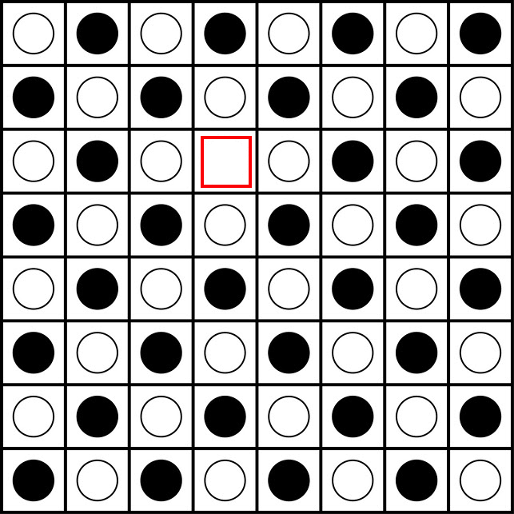
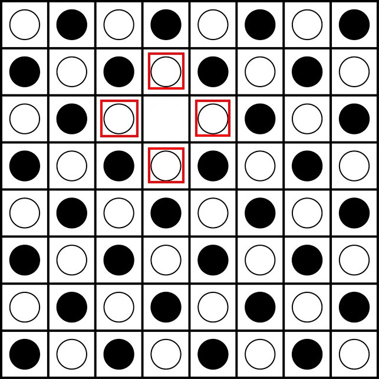

# Game Search

## Introduction: Konane

Also known as Hawaiian checkers, [konane](https://en.wikipedia.org/wiki/Konane) is a strategy game played between two
players. Players alternate taking turns, capturing their opponent's pieces by jumping their own pieces over them (if 
you're familiar with checkers, there is a strong structural analogy to be made here). The first player to be unable to
capture any of their opponent's pieces loses.

The full rules can be read *[here](https://en.wikipedia.org/wiki/Konane#Rules_and_gameplay)* or
*[here](http://www.konanebrothers.com/How-to-Play.html)*. Here's my (rather terse) version, though:




1. Black typically starts. They take one of their pieces off of the board.



2. White then takes one of their pieces off of the board from a space _orthogonally_ adjacent to the piece that black
removed.


3. Each player then alternately moves their pieces in capturing moves. A capturing move has a stone move in an
orthogonal direction, hopping over an opponent's piece. Multiple captures may be made in a turn, as long as the stone
moves in the same direction and captures at least one piece.


4. The first player to be unable to capture a piece loses. :(

## Play the game

Implementing minimax and alpha-beta pruning for an agent playing one such game—that of
konane. But first, you should get familiar with how the game is played. To do this, play the game with the provided code. You've been distributed a codebase which includes an interface for playing the game in a variety of modes.
Notably, you don't need to actually _make_ the game of konane—just to make an agent that plays it.

Run the following from your terminal:
```bash
python main.py $P1 $P2
```

By default, `main.py` will setup a human player versus a random player on a board that is 10x10. During **Human** mode, move the cursor with the ARROW keys and select the tile with SPACE. When it is a computer's turn, advance the game with the SPACE key. To see the game board in your terminal, you need a minimum terminal size of (rows + 2) x (columns + 2) to see the whole board. To exit the game, kill the process in your terminal (e.g., with CTRL-c).

You can change the game settings by passing in values to `python main.py`. You need to pass in _exactly_ two arguments. Valid arguments are as follows:

* H (Human)—manually select the tile to move and to where you will move it. Legal moves will be executed.
* D (Deterministic)—the agent will select the first move that it finds (the leftmost option in the tree) during its 
traversal.
* R (Random)—the agent will pick a random move.
* M (Minimax)—the agent will pick a move using the minimax algorithm. You will be prompted for a max. search depth.
* A (Alpha-beta pruning)—the agent will pick a move using AB pruning. You will be prompted for a max. search depth.

Passing in an invalid number or type of arguments will result in the system defaulting to a human vs a random player.

## Task

### Part 1: Minimax

### Part 2: Alpha-Beta Pruning
